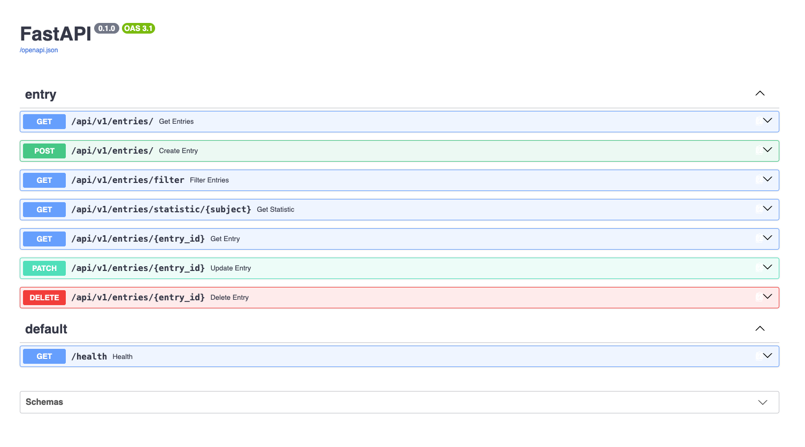

# Lern-Tracker-API


REST-API zum Erfassen und Auswerten von Lerneinheiten. Ein Eintrag besteht aus Fach, optionaler Beschreibung, Dauer und Datum. Die API bietet vollständiges CRUD, Filterung nach Fach und Zeitraum sowie eine Statistik pro Fach.

Lernprojekt zum Aufbau einer sauberen REST-API mit FastAPI, inklusive Validierung, Testabdeckung und CI.



Tech-Stack

| Bereich    | Technologie                  |
| ---------- | ---------------------------- |
| Framework  | FastAPI 0.139                |
| ORM/Models | SQLModel, Pydantic v2        |
| Datenbank  | SQLite                       |
| Server     | Uvicorn                      |
| Tests      | pytest, Starlette TestClient |
| CI         | GitHub Actions               |

## Quickstart

```bash
git clone https://github.com/florianwiet/study-tracker-api
cd study-tracker-api

python -m venv .venv
source .venv/bin/activate        # Windows: .venv\Scripts\activate

pip install -r requirements.txt
uvicorn main:app --reload
```

Die Datenbankdatei `entries.db` wird beim ersten Start automatisch angelegt.

- API: `http://127.0.0.1:8000`
- Interaktive Dokumentation (Swagger): `http://127.0.0.1:8000/docs`
- OpenAPI-Schema: `http://127.0.0.1:8000/openapi.json`

## Beispiel

Eintrag anlegen:

```bash
curl -X POST http://127.0.0.1:8000/api/v1/entries/ \
  -H "Content-Type: application/json" \
  -d '{
        "subject": "  Mathematik 2  ",
        "description": "Kapitel 3, Integralrechnung",
        "duration_in_minutes": 90,
        "date": "2026-09-05"
      }'
```

Antwort (`201 Created`):

```json
{
  "id": "8f14e45f-ceea-467a-9c2d-3b1c1f2a77e0",
  "subject": "mathematik 2",
  "description": "Kapitel 3, Integralrechnung",
  "duration_in_minutes": 90,
  "date": "2026-09-05",
  "created_on": "2026-09-05T14:22:31.884210Z"
}
```

Das Fach wird dabei normalisiert: überflüssige Leerzeichen werden zusammengefasst und die Schreibweise vereinheitlicht. `"  Mathematik 2  "` und `"MATHEMATIK 2"` landen also im selben Fach und in derselben Statistik.

Statistik abrufen:

```bash
curl http://127.0.0.1:8000/api/v1/entries/statistic/mathematik%202
```

```json
{
  "subject": "mathematik 2",
  "count": 4,
  "total_minutes": 315
}
```

## Endpunkte

Basis-Pfad: `/api/v1/entries`

| Methode | Pfad            | Beschreibung                    | Status          |
| ------- | --------------- | ------------------------------- | --------------- |
| POST    | `/`           | Neuen Lerneintrag anlegen       | 201 / 422       |
| GET     | `/`           | Alle Einträge abrufen          | 200             |
| GET     | `/{entry_id}` | Einzelnen Eintrag abrufen       | 200 / 404       |
| PATCH   | `/{entry_id}` | Eintrag teilweise aktualisieren | 200 / 404 / 422 |
| DELETE  | `/{entry_id}` | Eintrag löschen                | 200 / 404       |

### Filter und Auswertung

| Methode | Pfad                                       | Beschreibung                                  | Status          |
| ------- | ------------------------------------------ | --------------------------------------------- | --------------- |
| GET     | `/filter?subject=&start_date=&end_date=` | Einträge nach Fach und/oder Zeitraum filtern | 200 / 400 / 422 |
| GET     | `/statistic/{subject}`                   | Anzahl und Gesamtminuten pro Fach             | 200 / 404       |

Alle Filterparameter sind optional und kombinierbar. Ohne Parameter werden alle Einträge zurückgegeben. Ist `start_date` größer als `end_date`, antwortet die API mit `400`.

### Sonstiges

| Methode | Pfad        | Beschreibung | Status |
| ------- | ----------- | ------------ | ------ |
| GET     | `/health` | Health-Check | 200    |

Jede Antwort enthält zusätzlich den Header `X-Process-Time` mit der serverseitigen Bearbeitungszeit, zum Beispiel `0.0021s`.

## Datenmodell und Validierung

| Feld                    | Typ            | Regel                                         |
| ----------------------- | -------------- | --------------------------------------------- |
| `id`                  | String (UUID)  | wird serverseitig erzeugt                     |
| `subject`             | String         | 1 bis 50 Zeichen, Pflichtfeld                 |
| `description`         | String         | optional, 4 bis 1000 Zeichen                  |
| `duration_in_minutes` | Integer        | 1 bis 600                                     |
| `date`                | Date           | Pflichtfeld, darf nicht in der Zukunft liegen |
| `created_on`          | Datetime (UTC) | wird serverseitig gesetzt                     |

Zusätzliche Regeln:

- `subject` wird normalisiert (Leerzeichen zusammengefasst, einheitliche Kleinschreibung). Ein Fach, das nur aus Leerzeichen besteht, wird abgelehnt.
- `PATCH` aktualisiert ausschließlich die im Request enthaltenen Felder. Nicht mitgesendete Felder bleiben unverändert.
- Verstöße gegen die Feldregeln beantwortet FastAPI mit `422` und einer Detailmeldung pro betroffenem Feld.

## Tests

31 Tests decken alle Endpunkte ab, inklusive Fehlerfälle.

```bash
pip install -r requirements-dev.txt
pytest -v
```

Teststrategie:

- Jeder Test läuft gegen eine frische In-Memory-SQLite-Datenbank (`StaticPool`), die produktive `entries.db` wird nie berührt.
- Die Session-Dependency wird über `app.dependency_overrides` ausgetauscht, die Engine zusätzlich per `monkeypatch` ersetzt.
- Abgedeckt sind: CRUD-Happy-Paths, 404 bei unbekannter ID für GET, PATCH und DELETE, alle Validierungsgrenzen (Dauer 0 und über 600, Beschreibung zu kurz, Fach zu lang, leeres Fach, fehlendes Pflichtfeld, Datum in der Zukunft), Fach-Normalisierung bei POST und PATCH, alle Filterkombinationen inklusive ungültigem Zeitraum und ungültigem Datumsformat, Statistik mit und ohne Treffer, Health-Check und der `X-Process-Time`-Header.

Die Tests laufen bei jedem Push auf `main` und bei jedem Pull Request über GitHub Actions.

## Projektstruktur

```
main.py                    App-Instanz, Timing-Middleware, Lifespan, Health-Endpunkt
routes.py                  alle Endpunkte unter /api/v1/entries
schemas.py                 SQLModel-Tabelle, Create-/Update-Modelle, Validatoren
db.py                      Engine, Tabellenerzeugung, Session-Dependency
conftest.py                leer, setzt den Projektroot auf den Importpfad von pytest
tests/conftest.py          Fixtures fuer Test-Engine und TestClient
tests/routes_test.py       Testsuite
.github/workflows/ci.yml   CI-Pipeline
```

## Bekannte Einschränkungen

- Keine Authentifizierung und keine Nutzertrennung. Alle Einträge sind global sichtbar.
- Keine Pagination bei `GET /api/v1/entries/`. Bei großen Datenmengen wird die gesamte Tabelle zurückgegeben.
- Die Datenbank-URL ist in `db.py` fest hinterlegt. Ein Wechsel auf PostgreSQL erfordert eine Codeänderung.
- SQL-Logging ist aktiviert (`echo=True`), was in der Konsole bei jedem Request Ausgaben erzeugt. Für die Lernphase bewusst so belassen.
- Kein Deployment vorgesehen. Das Projekt ist als lokal lauffähige Referenzimplementierung gedacht.

## Lizenz

MIT, siehe [LICENSE](LICENSE).
